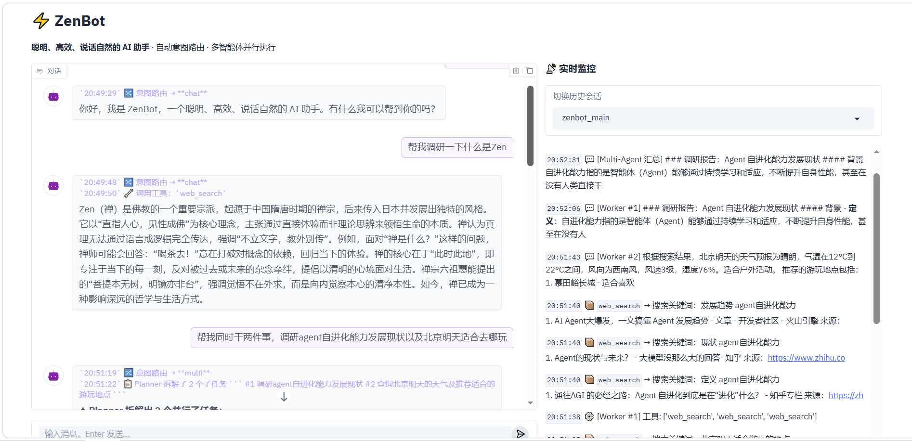

# ZenBot 项目整体文档

> 最后更新：2026-04-29

---

## 一、项目定位

ZenBot 是一个基于 **LangGraph** 构建的本地 AI 助手，支持命令行（CLI）和 Web UI 两种运行方式。它能自动判断用户意图，对简单对话直接回答，对复杂任务拆解为多个子任务分阶段并行执行，全程配有实时监控面板。

---

## 二、目录结构

```
ZenBot-main/
├── ZenBot/core/
│   ├── config.py          # 路径常量（DB_PATH、MEMORY_DIR、OFFICE_DIR 等）
│   ├── context.py         # MultiState / AgentState 定义 + trim_context_messages + _merge_worker_results
│   ├── multi_agent.py     # 主图工厂：router → chat/planner → workers → aggregator
│   ├── agent.py           # 旧单 Agent 实现（保留备用）
│   ├── provider.py        # 多模型适配（Aliyun / OpenAI / SiliconFlow / Anthropic / Ollama）
│   ├── skill_loader.py    # 动态加载 office/skills/ 下的技能包
│   ├── heartbeat.py       # 后台心跳（定时任务触发器）
│   ├── logger.py          # 审计日志（JSONL 异步写入，按 thread_id 分文件）
│   └── tools/
│       ├── builtins.py    # 内置工具（web_search、read/write_office_file 等）
│       ├── sandbox_tools.py  # 沙盒文件/Shell 工具
│       └── base.py        # 工具基类（ZenBot_tool 装饰器 / ZenBotBaseTool）
├── entry/
│   ├── main.py            # CLI 异步主入口：启动图、处理输入、渲染输出
│   ├── webui.py           # Gradio Web UI：对话、会话管理、实时监控
│   ├── cli.py             # CLI 命令入口（ZenBot run / monitor / config）
│   └── monitor.py         # 实时日志监控面板（tail JSONL + Rich 渲染）
├── workspace/
│   ├── state.sqlite3      # LangGraph checkpointer（所有会话的 messages + summary）
│   ├── memory/
│   │   ├── user_profile.md    # 用户长期画像（姓名、职业、偏好等）
│   │   └── shared_summary.md  # 已废弃（摘要现在存于 SQLite state["summary"]）
│   └── office/            # 沙盒工作区（agent 只能读写此目录）
│       └── skills/        # 动态技能包目录
└── logs/
    └── {thread_id}.jsonl  # 审计日志（每个会话独立文件）
```

---

## 三、状态定义

### MultiState（主图状态，存于 SQLite）

定义在 `ZenBot/core/context.py`。


| 字段             | 类型                | Reducer                    | 说明                                                       |
| ---------------- | ------------------- | -------------------------- | ---------------------------------------------------------- |
| `messages`       | `List[BaseMessage]` | `add_messages`（增量追加） | 完整对话历史，chat/multi 路径共用                          |
| `summary`        | `str`               | 覆盖                       | 滑动窗口压缩后的上下文摘要（≤150字）                      |
| `user_input`     | `str`               | 覆盖                       | 本轮用户原始输入                                           |
| `route`          | `str`               | 覆盖                       | `"chat"` 或 `"multi"`                                      |
| `tasks`          | `List[dict]`        | 覆盖                       | Planner 拆解的子任务列表，每项含`id`、`desc`、`depends_on` |
| `stages`         | `List[List[dict]]`  | 覆盖                       | 待执行的阶段队列（每阶段内并行）                           |
| `current_stage`  | `List[dict]`        | 覆盖                       | 当前正在执行的阶段                                         |
| `worker_results` | `List[str]`         | `_merge_worker_results`    | 所有 worker 的产出；写入`["__RESET__"]` 时清零             |
| `final_answer`   | `str`               | 覆盖                       | 最终回复内容；`"__replan__"` 为内部标记，触发重新规划      |

### WorkerState（Worker 子图状态，不持久化）

定义在 `ZenBot/core/multi_agent.py`。


| 字段              | 类型                | Reducer        | 说明                                                             |
| ----------------- | ------------------- | -------------- | ---------------------------------------------------------------- |
| `task_id`         | `int`               | —             | 子任务编号                                                       |
| `task_desc`       | `str`               | —             | 子任务描述                                                       |
| `prev_results`    | `List[str]`         | —             | 上一阶段产出，由`dispatch_current_stage` 经 `Send()` 注入        |
| `worker_messages` | `List[BaseMessage]` | `add_messages` | worker 内部消息历史（与主图`messages` 字段名不同，避免并行冲突） |
| `worker_results`  | `List[str]`         | `operator.add` | 本 worker 的输出，完成后合并到主图`worker_results`               |

---

## 四、LangGraph 图结构

### 主图（MultiState）

```
START
  │
  ▼
router ──────────────────────────────────────────────────────────────────┐
  │  每轮入口：                                                           │
  │  1. 重置瞬态字段（tasks/stages/worker_results/__RESET__/final_answer）│
  │  2. 滑动窗口压缩（≥40轮触发，保留最新10轮，旧轮次压缩进 summary）     │
  │  3. LLM 判断意图 → route="chat" 或 "multi"                           │
  │                                                                       │
  ├─── route="chat" ───► chat_agent ◄──── chat_tools                     │
  │                           │                  ▲                       │
  │                    有 tool_calls              │                       │
  │                           └──────────────────┘                       │
  │                      无 tool_calls                                    │
  │                           │                                          │
  │                        chat_done ──────────────────────────────► END  │
  │                                                                       │
  └─── route="multi" ──► planner ──► approval                            │
                                         │                               │
                              ┌──────────┼──────────────┐                │
                           replan    tasks=[]        confirmed            │
                              │          │               │               │
                           planner  aggregator    stage_dispatch         │
                                         │               │               │
                                         │    dispatch_current_stage     │
                                         │    （Send API 并行分发）       │
                                         │               ▼               │
                                         │         worker×N（子图）      │
                                         │               │               │
                                         └◄──────────────┘               │
                                      aggregator                         │
                                         │                               │
                              ┌──────────┴──────────┐                   │
                           stages 非空           stages 为空             │
                           （本阶段成功）        （全部完成）             │
                              │                      │                   │
                         stage_dispatch            END                   │
                                                                         │
                         （本阶段失败时 stages 清零，直接走 END）         │
```

### Worker 子图（WorkerState）

```
START ──► agent ──► collect ──► END
             ▲
             │  有 tool_calls
             │
           tools
```

---

## 五、核心数据流

### Chat 路径

```
用户输入
  └─► router_node
        ├─ 重置瞬态字段
        ├─ 滑动窗口压缩（可选）
        └─ LLM 判断 → route="chat"
  └─► chat_agent_node
        ├─ 读 state["messages"] + state["summary"]
        ├─ 构建 SystemMessage（含 summary、user_profile、skills）
        ├─ 判断是否为 tool 回调（最后一条是否为 ToolMessage）
        │   ├─ 否：追加 HumanMessage(user_input) 后推理
        │   └─ 是：直接推理，不追加
        └─ LLM 推理 → 有 tool_calls 或 content
  └─► chat_tools_node（如有工具调用）
        └─ 执行工具，结果写入 messages，回到 chat_agent
  └─► chat_done_node
        └─ 取最后 AI 消息 → final_answer
```

### Multi 路径

```
router → route="multi"
  └─► planner_node
        └─ LLM 输出 JSON 任务列表（含 depends_on 依赖关系）
  └─► approval_node（interrupt，等待用户 y/n）
        ├─ n → 收集改进建议（第二次 interrupt）→ 拼入 user_input → replan
        └─ y → final_answer="" 清除标记 → 继续
  └─► stage_dispatch_node
        └─ _build_stages() 拓扑排序，弹出第一阶段存入 current_stage
  └─► dispatch_current_stage（条件边，Send API）
        └─ 并行创建 N 个 worker，注入：
            - task_id / task_desc
            - prev_results（上一阶段产出）
            - worker_messages（system prompt + HumanMessage）
  └─► worker 子图 × N（并行）
        └─ agent → tools* → collect
        └─ 产出写入 worker_results（_merge_worker_results 累积）
  └─► aggregator_node
        ├─ 还有后续阶段：LLM 判断 success/failure
        │   ├─ failure → 生成失败原因 → 写入 messages → 清空 stages → END
        │   └─ success → 回到 stage_dispatch 执行下一阶段
        └─ 所有阶段完成：LLM 汇总所有 worker_results → final_answer
              └─ 写入 messages：[HumanMessage(user_input), AIMessage(final_answer)]
```

### 上下文记忆流

```
每轮对话结束后，messages 通过 add_messages reducer 增量写入 SQLite
  └─► 下轮进入 router_node，读取完整 messages
        └─► trim_context_messages(trigger=40, keep=10)
              ├─ < 40 轮：不触发，直接用全量消息
              └─ ≥ 40 轮：
                    ├─ 保留最新 10 轮
                    ├─ 丢弃的旧轮次 → LLM 压缩 → 更新 state["summary"]
                    └─ RemoveMessage 从 SQLite 删除旧消息
```

---

## 六、会话管理


| 操作            | 效果                                                                                                  |
| --------------- | ----------------------------------------------------------------------------------------------------- |
| 正常启动        | `thread_id = "ZenBot_main"`，历史从上次断点继续                                                       |
| CLI`/new`       | `thread_id = "ZenBot_main_1/2/3..."`，新 thread 的 messages 和 summary 均为空                         |
| Web UI 新会话   | `thread_id = "ZenBot_main_{4位随机数}"`，同上                                                         |
| Web UI 切换会话 | 从 SQLite 加载对应 thread_id 的历史消息，同步刷新 Monitor 日志                                        |
| Web UI 删除会话 | 从 SQLite 删除该 thread_id 的所有 checkpoint，同时删除对应`.jsonl` 日志文件，自动切换到下一个可用会话 |

---

## 七、工具体系

### 内置工具（所有路径可用）


| 工具名                  | 功能                                         |
| ----------------------- | -------------------------------------------- |
| `web_search`            | Tavily 联网搜索                              |
| `get_current_time`      | 获取系统当前时间                             |
| `calculator`            | 数学表达式计算                               |
| `read_office_file`      | 读取 office/ 目录下的文件                    |
| `write_office_file`     | 写入/覆盖/追加 office/ 目录下的文件          |
| `list_office_files`     | 列出 office/ 目录下的文件和文件夹            |
| `execute_office_shell`  | 在 office/ 目录下执行 Shell 命令（沙盒限制） |
| `save_user_profile`     | 更新 workspace/memory/user_profile.md        |
| `get_system_model_info` | 查询当前使用的模型提供商和型号               |
| `schedule_task`         | 设置定时提醒/闹钟                            |
| `list_scheduled_tasks`  | 查看所有待执行的定时任务                     |
| `delete_scheduled_task` | 取消指定定时任务                             |
| `modify_scheduled_task` | 修改定时任务的时间或内容                     |

### 动态技能（Skills）

存放于 `workspace/office/skills/<skill-name>/`，每个技能包含：

- `SKILL.md`：技能说明书（agent 必须先 `mode='help'` 读取）
- 可选 Python 脚本（script 型技能）

两种类型：

- **workflow 型**：只有 SKILL.md，agent 读完步骤后直接用内置工具执行
- **script 型**：含独立脚本，通过 `execute_office_shell` 运行

Agent 启动时自动扫描并注入系统 prompt，使用时先 help 再 run。

---

## 八、审计日志与 Monitor

### 日志格式（`logs/{thread_id}.jsonl`）

每行一条 JSON：

```json
{"ts": "2026-04-29T03:25:50Z", "thread_id": "ZenBot_main", "event": "tool_call", "tool": "web_search", "args": {...}}
```

### 事件类型


| event           | 触发时机                                | Monitor 显示         |
| --------------- | --------------------------------------- | -------------------- |
| `system_action` | 路由判断、worker 工具调用、Planner 拆解 | 黄色单行文本         |
| `tool_call`     | chat_agent 决定调用工具                 | 紫色 Panel（含参数） |
| `tool_result`   | 工具执行完毕返回结果                    | 青色 Panel（含摘要） |
| `ai_message`    | chat/worker 生成文字回复                | 亮紫色 Panel         |
| `llm_input`     | 发送给 LLM 的消息数量                   | 白色单行文本         |

---

## 九、Web UI（Gradio）

入口：`entry/webui.py`，访问 `http://localhost:7860`。

### 布局

```
┌──────────────────────────────┬──────────────────────────┐
│  对话区（左侧）               │  监控区（右侧）            │
│  ┌────────────────────────┐  │  📡 实时监控              │
│  │ ChatClaw（气泡布局）     │  │  切换历史会话 Dropdown    │
│  └────────────────────────┘  │  Monitor 日志 Markdown    │
│  输入框 + 发送按钮            │  🔄 刷新日志              │
│  🆕 新会话  🗑️ 清空显示       │  🗑️ 删除会话              │
│  会话标签                     │                          │
└──────────────────────────────┴──────────────────────────┘
```



### 关键功能


| 按钮/操作     | 效果                                                                   |
| ------------- | ---------------------------------------------------------------------- |
| 发送消息      | 自动判断是否处于 Planner 审批状态，路由到`_run_turn` 或 `_resume_turn` |
| 🆕 新会话     | 创建新 thread_id，清空对话显示                                         |
| 🗑️ 清空显示 | 仅清空 UI 显示，不删除 SQLite 数据                                     |
| 切换历史会话  | 从 SQLite 加载历史消息，刷新 Monitor                                   |
| 🔄 刷新日志   | 重新读取`.jsonl`，更新 Monitor 和会话列表                              |
| 🗑️ 删除会话 | 删除 SQLite checkpoint +`.jsonl` 日志，切换到下一个会话                |

---

## 十、启动方式

```bash

# 安装依赖
pip install -e .

# 配置 .env
DEFAULT_PROVIDER=aliyun
DEFAULT_MODEL=qwen-plus
OPENAI_API_KEY=sk-xxx
OPENAI_API_BASE=https://api.siliconflow.cn/v1
TAVILY_API_KEY=tvly-xxxxx

# 启动 CLI
zenbot run

# 启动 Web UI
zenbot web
python entry/webui.py

# 启动监控面板（CLI 模式下另开终端）
ZenBot monitor
```

### CLI 命令


| 命令           | 效果                                   |
| -------------- | -------------------------------------- |
| `/new`         | 开启新会话，历史隔离                   |
| `/multi`       | 切换 Multi-Agent / 单 Agent 模式       |
| `/exit`        | 退出程序，状态持久化                   |
| `y`            | Planner 审批阶段确认执行               |
| `n`            | Planner 审批阶段拒绝，触发改进建议收集 |
| 拒绝后输入建议 | 带入反馈重新规划（replan）             |
